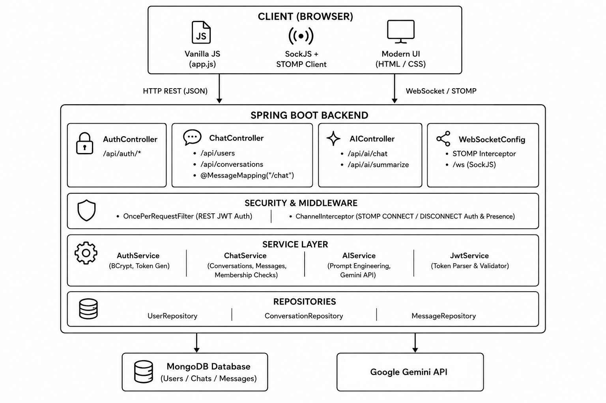

# Real-Time Chat

> A full-stack, enterprise grade real time messaging application with 1 on 1 chat, groups, AI assistant and summarization.

---

## Project Overview

This project is built to demo the real-time web application architecture. It solves the challenge of instant communication, authenticated real time, and AI assistance inside a clean single page interface.

### Tech Stack
- **Backend**: Java 17, Spring Boot 3.3.5 (Web, Data MongoDB, WebSocket / STOMP, Security, Validation)
- **Database**: MongoDB (NoSQL Document Store)
- **Security**: Spring Security 6, JWT, BCrypt Password Hashing
- **Real-Time Messaging**: Spring WebSocket, STOMP Messaging Protocol, SockJS
- **AI Engine**: Google Gemini API (`gemini-2.5-flash`)
- **Frontend**: JavaScript, Modern CSS3, HTML5, `@stomp/stompjs`

---

## Features

- **Secure Authentication**: User registration and login powered by BCrypt password encryption and signed JWT access tokens.
- **1-on-1 Direct Messaging**: Private messaging.
- **Group Chats**: Multiple user group chat.
- **Live Online/Offline**: Real time online status via WebSocket connection lifecycle hooks.
- **AI Chat & Summarization**:
  - AI assistant in the sidebar.
  - One click summarizer that parses chat history and generates points using Gemini.

---

## Architecture & System Design




## Setup

### Requirements
- Java 17+
- Maven 3.8+
- MongoDB instance (local or MongoDB Atlas)
- Google Gemini API Key

### 1. Backend 
Create an `.env` file or export environment variables in `backend/chatapp/chatapp/`:
```env
PORT=8080
MONGODB_URI=
MONGODB_DATABASE=
JWT_SECRET=
GEMINI_API_KEY=
```

Run the backend:
```bash
cd backend/chatapp/chatapp
./mvnw spring-boot:run
```

### 2. Frontend
Open `frontend/index.html` via Live Server.

---